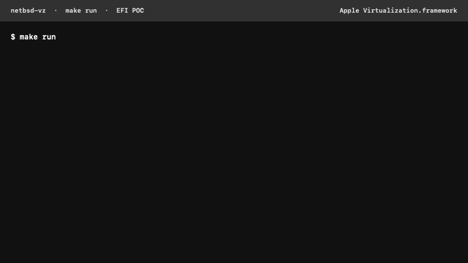

# NetBSD 11 EFI boot on Apple Virtualization.framework

This proof of concept builds and boots NetBSD 11.0/evbarm-aarch64 on an
Apple Silicon Mac through Virtualization.framework's generic EFI platform.
It uses the stock NetBSD `bootaa64.efi` loader and stock `GENERIC64` kernel
configuration.

The only NetBSD source changes are three generic Virtio fixes: PCI memory
decoding, reset-completion waiting, and network MTU negotiation. There is no
VZ-specific kernel configuration or fallback to
[the earlier direct-boot implementation](https://tbarabosch.com/porting-netbsd-to-apple-vz/).



_Condensed from an actual offline `make run` EFI boot. Machine-local paths
and repetitive output are omitted._

## Requirements

- Apple Silicon Mac with Virtualization.framework
- Xcode or Xcode Command Line Tools selected with `xcode-select`
- `make` and network access to the official NetBSD archives
- About 10 GiB of free space for source, tools, objects, and images

The first build downloads SHA-512-pinned NetBSD 11.0 source sets and builds
the NetBSD AArch64 cross-tools locally.

## Why EFI instead of our earlier direct-boot work?

EFI follows NetBSD's normal arm64 boot contract: firmware loads the stock
`bootaa64.efi` from a GPT disk, and the loader starts stock `GENERIC64` using
ACPI hardware discovery. [Our earlier direct-boot
work](https://tbarabosch.com/porting-netbsd-to-apple-vz/) instead required a
raw AArch64 Image, an FDT supplied by the host, and changes around bootstrap
and console selection.

For this project, EFI is superior because the goal is the smallest possible
upstream NetBSD change. It removes the VZ-specific loader, FDT, raw-image,
and forced-console delta, leaving only generic Virtio driver fixes. EFI does
require an EFI System Partition, variable-store state, and a Virtio GPU for
GOP, and it can take longer to boot; the earlier approach can still be useful
when a small, firmware-free boot path matters more than matching normal
hardware.

## Build and run

```sh
make build
make disk

make run
make run-network
make clean
```

`make run` boots without a network device. `make run-network` adds a Virtio
network device attached to VZ NAT.

The default disk is copy-on-write cloned for each run, and EFI state is
temporary. Passing another disk attaches it directly; passing an EFI-state
directory reuses the machine identifier and EFI variable store.

## Output and overrides

```text
.build/out/netbsd-GENERIC64
.build/out/netbsd-vz.raw
```

`netbsd-vz.raw` is a 1,088 MiB GPT disk. It contains a 64 MiB FAT32 EFI
System Partition followed by an FFSv1 root partition named `netbsd-root`.

```sh
NETBSD_VZ_JOBS=8 make build
NETBSD_VZ_TIMEOUT=180 make run
DISK=/absolute/path/netbsd.raw make run
./scripts/run.sh --disk /absolute/path/netbsd.raw \
    --efi-state /absolute/path/efi-state
```

The runner always uses EFI. There is deliberately no boot-mode selector.

## Console and security

EFI and early kernel output use the Virtio GPU's GOP display. Interactive
headless login becomes available through the stock getty on `/dev/ttyVI00`;
run `dmesg` after login to inspect the early kernel log.

The POC image retains the release set's empty root password. No inbound
service is enabled. Do not enable remote services or expose the image to an
untrusted network without setting a root password.

See [docs/TECHNICAL.md](docs/TECHNICAL.md) for the boot contract, disk format,
and remaining NetBSD patch set.

## License

MIT. See [LICENSE](LICENSE).
